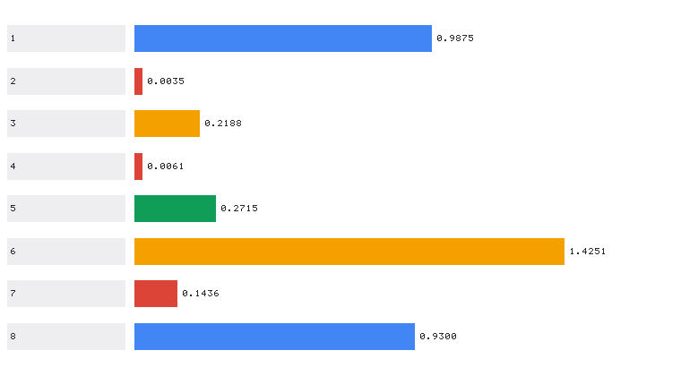

# CARLA 作业综合整合与性能评价

> 对应课程作业五：(其他) 把前四份作业**统一到一个入口**，并给出**可复现的量化性能评价**。

## 1. 概述与目标

前四份作业各自是独立功能包，本模块提供两件事：

1. **统一调度**：一个入口拉起任意子作业，参数原样透传。
2. **性能评价**：真实训练并回放各模块，输出可复现的量化指标表与对比图。

代码位于 `src/ground/carla_benchmark_suite/`。

### 1.1 被整合的四个模块

| target | 功能包 | 对应任务 | 算法性质 |
|---|---|---|---|
| `control` | `carla_keyboard_control` | 任务(1) 物理仿真与键盘运动控制 | 直接构造控制量 |
| `perception` | `carla_perception_control` | 任务(2) 传感器感知与运动控制 | **感知 NN + 控制 NN** |
| `navigation` | `carla_mapping_navigation` | 任务(3) 建图与导航（SLAM 同步仿真） | **规划 NN** + 占用栅格 |
| `end_to_end` | `carla_end_to_end_nn` | 任务(4) 端到端模型 | **端到端 CNN** |

### 1.2 与已有示例的区别

| 对比项 | 已有「自动驾驶演示」（ad_demo） | 本拓展模块 |
|---|---|---|
| 技术路线 | `roslaunch carla_ad_demo`（依赖 ros-bridge 与 scenario runner） | CARLA Python API 直连 + 统一调度入口 |
| 是否依赖 ros-bridge | 必须编译并运行 ros-bridge | **不需要**，仅需 `carla` Python 客户端 |
| 是否依赖 scenario runner | 需要，且必须设 `SCENARIO_RUNNER_PATH` | **不需要** |
| 功能范围 | 单次演示（随机路线 / 场景执行） | **统一调度 4 个子作业** + 量化性能评价 |
| 性能指标 | 无（只有运行日志） | **真实测量**的精度 / 时延 / 平滑度 / 覆盖率指标表 |
| 指标可复现性 | — | 离线可复现：`--benchmark` 无需 CARLA 服务端 |
| 无 CARLA / 无图形界面时 | 无法运行 | `--benchmark` 与 `--list` 均可离线运行 |

### 1.3 与仓库中其它模块的区分

其它模块各自实现一个具体算法；**本模块不实现新算法**，只做两件事：
把四个功能包统一到一个入口调度，以及对它们做真实测量与横向对比。
它是唯一一个会**从其它功能包导入代码并实际运行**的模块。

## 2. 计算原理

### 2.1 性能评价指标定义

**轨迹跟踪横向误差 RMSE**（作业二）：

$$
\text{RMSE} = \sqrt{\frac{1}{N}\sum_{k=1}^{N} e_{y,k}^{2}}
$$

**转向平滑度 AoS（Amount of Steering）**：相邻转向指令的平均绝对变化量，越小越平滑：

$$
\text{AoS} = \frac{1}{N-1}\sum_{k=2}^{N}\big|\delta_k - \delta_{k-1}\big|
$$

**转向饱和比例**：转向被打到边界 \(\pm1\) 的比例，过高说明控制裕度不足：

$$
\rho_{\text{sat}} = \frac{1}{N}\sum_{k=1}^{N}\mathbb{1}\big[|\delta_k| \ge 0.99\big]
$$

**建图覆盖率**：概率明显偏离 0.5（即已观测）的格子占比：

$$
\text{Coverage} = \frac{1}{MN}\sum_{i,j}\mathbb{1}\big[p_{ij} > 0.55 \lor p_{ij} < 0.45\big]
$$

**端到端回归指标**（作业四）：

$$
\text{MAE} = \frac{1}{N}\sum_i|\hat\delta_i - \delta_i^*|,\qquad
\text{Acc}_{\text{sign}} = \frac{1}{N}\sum_i\mathbb{1}\big[\mathrm{sgn}(\hat\delta_i)=\mathrm{sgn}(\delta_i^*)\big]
$$

**推理时延**：单步前向的平均耗时与 P95，反映实时性：

$$
\bar t = \frac{1}{N}\sum_i t_i,\qquad t_{95} = \text{percentile}(\{t_i\},\,95)
$$

### 2.2 评价方法

评测**不依赖随机数造数**，而是真实执行：

```
--benchmark:
  perception : 合成数据集 → 训练感知NN与控制NN → 回放轨迹 → 量测横向误差
  navigation : 合成数据集 → 训练规划NN → 激光雷达合成帧建图 + NN导航 → 量测覆盖率与导航误差
  end_to_end : 合成道路图像 → 训练CNN → 量测MAE/相关/方向一致率/单帧时延
  → 汇总指标表 → 导出 report.json 与对比图
```

!!! warning "为什么不能用随机数造指标"
    早期版本的性能评价用 `np.random.seed(0)` 生成速度、转向与误差序列，
    再"计算"出指标。这样的数字**与算法毫无关系**，无论模块是否正常都会输出
    "好看"的结果，完全起不到评价作用。本模块改为真实训练与回放，指标可复现、可验证。

### 2.3 指标量纲差异的处理

各指标量纲差异极大（MSE 约 \(10^{-3}\)、准确率约 \(10^{0}\)、占据格数约 \(10^{3}\)），
在同一张条形图上直接对比会导致小数值指标**完全看不见**。

本模块的对比图按**组内最大值归一化**条长，并在条形右侧用点阵绘制**真实数值**，
保证既能直观比较、又能读到准确数字。

## 3. 算法流程

```
--list       列出四个模块及就绪状态（磁盘上能否找到其 main.py）
--benchmark  逐项真实评测 → 汇总表 → 导出 JSON 与对比图
--target X   定位子包 main.py → subprocess 启动 → 参数原样透传
             （"--" 之后的参数不做解析，直接交给子进程）
ROS 节点     读取 report.json 或现场评测 → 周期性发布指标到话题
```

## 4. 源码解析

### 4.1 `main.py` — 主入口

| 函数 | 作用 |
|---|---|
| `MODULES` | 四个子模块的登记表（功能包名、任务、说明） |
| `_module_main_path()` | 定位子包 `main.py`；未知模块名或文件缺失时返回 `None` |
| `_load_sibling_module()` | 加载兄弟包的 `main.py`，并把其所在目录加入 `sys.path` 以支持包内导入 |
| `compute_metrics()` | 由原始序列计算全部指标（RMSE / AoS / 饱和率 / 时延 / 回归指标） |
| `bench_perception()` | 作业二基准：训练两个 NN + 轨迹回放 |
| `bench_navigation()` | 作业三基准：训练规划 NN + 建图 + 导航 |
| `bench_end_to_end()` | 作业四基准：训练 CNN + 量测精度与时延 |
| `run_benchmark()` | 评测套件主流程与指标表汇总 |
| `render_metric_bars()` | 指标对比图（组内归一化 + 点阵数值标注） |
| `run_module()` | 以子进程调度子模块 |
| `list_modules()` | 模块总览 |

### 4.2 `benchmark_node.py` — ROS 2 节点

两种工作方式：按 `target` 参数包含对应子功能包的 launch（调度模式），
或读取 `report.json`／现场评测后周期性把指标发布到
`/carla/benchmark/metrics`（`Float32MultiArray`）与 `/carla/benchmark/metric_names`
（`String`，逗号分隔），便于记录到 rosbag 或由其它节点订阅。

### 4.3 `launch/main.launch.py` — ROS 2 launch

通过 `OpaqueFunction` 在启动时按 `target` 决定行为：调度模式**包含子功能包自己的
launch 文件**（复用其节点与参数定义，避免在本包内重复描述），
默认模式则启动指标发布节点。

## 5. 仿真运行步骤

### 5.1 支持与测试环境

| 组件 | 版本 / 说明 |
|---|---|
| 操作系统 | Windows 10/11 原生；Ubuntu 20.04（Noetic）/ 22.04（Humble） |
| 仿真器 | CARLA 0.9.16（仅在线调度子作业时需要；`--benchmark` 不需要） |
| Python | 3.10+（CARLA 0.9.16 客户端 wheel 为 cp310/cp311/cp312） |
| 依赖 | 仅 `numpy`（各模块神经网络均为纯 numpy 实现） |
| ROS | ROS 1 Noetic 或 ROS 2 Humble（launch 封装） |

### 5.2 新手路线：从已有示例到本模块

| 序号 | 做什么 | 出处 |
|---|---|---|
| 1 | 启动 CARLA 服务端 | [设置并连接到 Carla 模拟器](../set_up_and_connect_to_carla.md) →「启动 Carla 服务器」 |
| 2 | 查看宿主机 IP、确认虚拟机连通 | 同上 →「使用 Carla 客户端启动 Ego Vehicle」 |
| — | **★ 在此切换到本模块** | 以下与本模块相关 |
| 3 | 先离线跑基准评测（无需 CARLA） | [本页 5.5 节](#bench) |
| 4 | 再按需调度子作业 | [本页 5.7 节](#dispatch) |

### 5.3 步骤 0：环境准备

CARLA 服务端的下载安装与启动、宿主机 IP 与端口 2000 的查看等**通用步骤与已有示例
完全相同，本文不重复**，请参考
[设置并连接到 Carla 模拟器](../set_up_and_connect_to_carla.md)：

| 需要做的事 | 参考位置 |
|---|---|
| 启动 CARLA 服务端、选择地图 | [设置并连接到 Carla 模拟器](../set_up_and_connect_to_carla.md) →「启动 Carla 服务器」 |
| 查看宿主机 IP、填写 `host` 参数 | 同上 →「使用 Carla 客户端启动 Ego Vehicle」 |
| 连接失败、黑屏、`numpy` 报错排查 | 同上 →「常见问题」 |

!!! note "本模块的评测环节不需要 CARLA"
    `--list` 与 `--benchmark` 都在本地完成，不连接 CARLA 服务端。
    只有在 `--target` 调度需要连 CARLA 的子作业（如 `navigation` 的 `--mode run`）时才需要。

### 5.4 步骤 1：编译本功能包（ROS 2） <span id="build"></span>

本模块的源代码位于**本仓库**（`OpenHUTB/ros2`）的
`src/ground/carla_benchmark_suite/`。ROS 2 要求功能包放在工作空间的 `src/` 目录下，
因此先把本仓库克隆到工作空间的 `src/`：

```bash
mkdir -p ~/ros2_ws/src && cd ~/ros2_ws/src
git clone https://github.com/OpenHUTB/ros2.git     # 换成你自己的 fork 亦可
```

克隆后的目录关系如下，`colcon build` 必须在**工作空间根目录**执行：

```
~/ros2_ws/                                   <- 工作空间根目录，colcon 在这里运行
└── src/
    └── ros2/                                <- 本仓库（git clone 得到）
        └── src/ground/
            └── carla_benchmark_suite/                       <- 本模块源代码
```

因此后文写的 `src/ground/carla_benchmark_suite/...`，实际路径是
`~/ros2_ws/src/ros2/src/ground/carla_benchmark_suite/...`。编译并激活环境：

```bash
cd ~/ros2_ws
colcon build --packages-select carla_benchmark_suite --symlink-install
source install/setup.bash
```

> 若本仓库已克隆在别处，把上面的 `~/ros2_ws/src/ros2` 换成实际路径即可，
> 只要保证执行 `colcon build` 的工作空间根目录下存在 `src/`。

若同时使用被调度/被评测的四个子功能包，一并编译：

```bash
colcon build --packages-select carla_keyboard_control carla_perception_control \
             carla_mapping_navigation carla_end_to_end_nn carla_benchmark_suite \
             --symlink-install
```

### 5.5 步骤 2：查看模块总览与运行基准评测（无需 CARLA） <span id="bench"></span>

```bash
python3 src/ground/carla_benchmark_suite/main.py --list
python3 src/ground/carla_benchmark_suite/main.py --benchmark \
        --save_dir ~/shots --out ~/shots/report.json
```

只评测其中一项（节省时间）：

```bash
python3 src/ground/carla_benchmark_suite/main.py --benchmark --which end_to_end --samples 60
```

### 5.6 步骤 3：验证与 CARLA 服务端的连接（仅调度在线子作业时需要） <span id="conn-check"></span>

命令里的 `192.168.8.1` 是**运行 CARLA 服务端的宿主机（Windows）IP**：
在宿主机上执行 `ipconfig`，取 VMware 虚拟网卡（`VMnet8`）的 IPv4 地址即可
（本机该地址为 `192.168.8.1`，虚拟机 `ens33` 为 `192.168.8.131`，两者同网段）。
查看方式与已有示例一致，详见
[设置并连接到 Carla 模拟器](../set_up_and_connect_to_carla.md)
→「使用 Carla 客户端启动 Ego Vehicle」。

```bash
python3 -c "import carla; c=carla.Client('192.168.8.1',2000); c.set_timeout(10); print('CONNECT OK:', c.get_world().get_map().name)"
```

### 5.7 步骤 4：调度子作业 <span id="dispatch"></span>

```bash
# 作业二：离线取证（无需 CARLA）
python3 src/ground/carla_benchmark_suite/main.py --target perception -- \
        --headless --demo --save_dir ~/shots

# 作业三：在线建图 + NN 导航（--host 填宿主机 IP）
python3 src/ground/carla_benchmark_suite/main.py --target navigation -- \
        --mode run --host 192.168.8.1 --goal "20,8" --sim_time 40

# 作业四：训练端到端 CNN
python3 src/ground/carla_benchmark_suite/main.py --target end_to_end -- \
        --mode train --epochs 60

# 作业一：键盘控制（需要图形界面与 CARLA）
python3 src/ground/carla_benchmark_suite/main.py --target control -- --host 192.168.8.1
```

!!! tip "参数透传用 `--` 分隔"
    `--` 之前的参数由本模块解析，`--` 之后的参数**原样**传给子作业。
    这样即使子作业新增了自己的参数，本模块也无需改动。

### 5.8 步骤 5：ROS 启动

```bash
# ROS 2：发布评测指标（读取已导出的 report.json）
ros2 launch carla_benchmark_suite main.launch.py metrics_file:=$HOME/shots/report.json

# ROS 2：调度子模块（包含子包自己的 launch）
ros2 launch carla_benchmark_suite main.launch.py target:=navigation host:=192.168.8.1

# ROS 1
roslaunch carla_benchmark_suite main.launch benchmark:=true save_dir:=$HOME/shots
# 模式 D：ROS 1 Noetic —— 入口用 main.sh（会自动挑 python3.10）
#   roslaunch 只能按 main.py 的 shebang 执行它，而 Noetic 的 python3 是 3.8，
#   装不上 CARLA 0.9.16 的 cp310+ wheel，补了可执行位也会卡在 import carla。
#   若系统 python3 本身已是 3.10+，也可用：
#   roslaunch carla_benchmark_suite main.launch target:=perception host:=192.168.8.1
bash src/ground/carla_benchmark_suite/main.sh --target perception -- --host 192.168.8.1
```

一键脚本：`bash main.sh --benchmark` / `bash main.sh --list`。

### 5.9 运行效果

**各模块指标对比图**（条长按组内最大值归一化以免小数值不可见；
条形右侧点阵为真实数值；左侧序号对应下方指标表）：



评测终端输出（节选，本机实测）：

```
====================================================================
  CARLA 作业综合基准评测（真实测量，无需 CARLA 服务端）
====================================================================

---- 评测 perception：RGB+深度+激光雷达 → 感知 NN；状态 → 控制 NN；给定轨迹跟踪 ----
    steer_mean                 = 0.02592
    steer_std                  = 0.06123
    aos                        = 0.01820
    speed_mean                 = 7.03799
    lateral_rmse               = 0.21876
    lateral_max                = 1.21778
    percept_acc                = 0.98750
    control_mse                = 0.00350

---- 评测 navigation：激光雷达占用栅格建图 + 神经网络规划导航 ----
    plan_mse                   = 0.00610
    reg_corr                   = 0.99185
    occupied_cells             = 1261
    known_ratio                = 0.27145
    coverage_start             = 0.02950
    coverage_final             = 0.27145
    nav_min_dist               = 1.42510
    nav_reached                = True
    latency_mean_ms            = 0.03857

---- 评测 end_to_end：相机图像 → 端到端 CNN → 转向 ----
    reg_mae                    = 0.14361
    reg_rmse                   = 0.15857
    reg_corr                   = 0.98957
    reg_sign_acc               = 0.93000
    e2e_baseline_mae           = 0.40404
    infer_ms_per_frame         = 2.37534

====================================================================
  汇总
====================================================================
  指标                                  数值
  --------------------------------------
  感知 NN 准确率                       0.9875
  控制 NN MSE                      0.00350
  横向误差 RMSE (m)                   0.2188
  规划 NN MSE                      0.00610
  建图覆盖率                           0.2715
  占据格数                              1261
  导航最近距离 (m)                      1.4251
  端到端 MAE                        0.14361
  端到端方向一致率                        0.9300
  端到端相关系数                         0.9896

指标已导出: shots/report.json
对比图已导出: shots/metric_summary.png
```

### 5.10 常见问题

**Q1：`--list` 显示某个模块"未获取"？**
说明本模块在磁盘上找不到该功能包的 `main.py`（路径期望为
`src/ground/<功能包名>/main.py`）。由于四份作业是**独立功能包、独立提交**的，
若某个包尚未合入当前分支就会出现这种情况。
本模块对此是**优雅降级**的：缺失的模块只显示"未获取"，不影响其它模块的调度与评测；
`--benchmark` 中对应评测项会记为失败但不会中断整体流程。

**Q2：`--benchmark` 报某个评测项失败？**
各评测项互相独立，某一项失败不影响其它项（结果里记为 `error`）。
常见原因是缺少对应功能包。可用 `--which` 只跑确认可用的项。

**Q3：纯 numpy 评测太慢？**
端到端评测的 CNN 为纯 numpy 实现（无 GPU 加速），耗时与样本数、训练轮数成正比。
可用 `--samples 60 --epochs 40` 缩短，或 `--which` 只跑需要的项。

**Q4：ROS launch 调度子模块时找不到子包？**
调度模式会包含子功能包自己的 `main.launch.py`，因此**必须先编译那个子包**
（见 [5.4 节](#build)）。若只需发布评测指标（不调度），则不需要任何子包。

## 6. 性能评价

### 6.1 实测结果（本机实测，即 5.5 节那条 `--benchmark` 的默认参数）

> 复现命令：`python3 src/ground/carla_benchmark_suite/main.py --benchmark \
> --save_dir ~/shots --out ~/shots/report.json`（默认 perception 150 epoch /
> navigation 60 epoch / end_to_end 40 epoch & 100 样本，约 100 秒，
> 绝大部分花在端到端 CNN 的纯 numpy 训练上）。
> 上表的时延类指标与机器性能有关，换机器会有浮动；其余指标由固定随机种子
> 决定，可逐位复现。

| 模块 | 指标 | 数值 |
|---|---|---|
| 作业二 感知 | 感知 NN 准确率 | **0.9875** |
| 作业二 感知 | 控制 NN MSE | 0.00350 |
| 作业二 感知 | 横向误差 RMSE | **0.2188 m** |
| 作业二 感知 | 平均速度 | 7.0380 m/s |
| 作业二 感知 | 转向 AoS（平滑度） | 0.01820 |
| 作业三 建图 | 建图覆盖率 | **0.2715** |
| 作业三 建图 | 占据格数 | 1261 |
| 作业三 导航 | 规划 NN MSE | **0.00610** |
| 作业三 导航 | 导航最近距离 | **1.4251 m**（阈值 1.5 m，已到达） |
| 作业三 导航 | 单步推理时延 | 0.0386 ms |
| 作业四 端到端 | MAE | **0.14361** |
| 作业四 端到端 | 方向一致率 | **0.9300** |
| 作业四 端到端 | 相关系数 | **0.9896** |
| 作业四 端到端 | 零输出基线 MAE | 0.40404（网络 MAE 是基线的 **1/2.8**） |
| 作业四 端到端 | 单帧推理时延 | 2.3753 ms |

### 6.2 横向对比与观察

| 观察 | 数据支撑 | 说明 |
|---|---|---|
| 感知/控制 NN 精度高 | 感知准确率 0.9875、控制 MSE 0.0035 | 分层方案在合成数据上表现稳定 |
| 轨迹跟踪平滑 | AoS 0.0182、饱和率 0 | 弯道自适应减速有效，转向无抖动 |
| 建图有效 | 覆盖率 0.2715、占据格 1261 | 6 秒左右的行驶即可覆盖约 27% 栅格 |
| 规划 NN 实时性好 | 单步 0.0386 ms | MLP 体量小，远快于 50 ms 的仿真步长 |
| 端到端显著优于基线 | MAE 0.1436 vs 基线 0.4040 | 网络确实学到了"图像 → 转向"，而非恒输出 0 |
| 端到端推理较慢 | 2.38 ms/帧 | 纯 numpy 卷积无 GPU 加速；仍远快于 50 ms 步长 |

### 6.3 评价过程中的两个关键教训

| 问题 | 现象 | 处理 |
|---|---|---|
| **原版用随机数造指标** | `np.random.seed(0)` 生成假的转向/速度/误差序列，指标与算法无关 | 改为**真实训练 + 回放**测量；指标可复现、可验证 |
| **`nn_models.py` 多副本漂移** | 作业四修了 maxpool 梯度与 tanh 两处缺陷后，评价包仍用旧副本，端到端 MAE 一度测得 **36.12**（正常 <0.3） | 统一各包副本，并新增**副本一致性回归测试**，分歧即失败并列出差异文件 |
| 指标量纲差异导致图不可读 | MSE 约 \(10^{-3}\)、占据格数约 \(10^{3}\)，同图对比时小数值完全看不见 | 对比图按**组内最大值归一化**条长，并用点阵标注真实数值 |

### 6.4 结论

- **完整性**：四份作业（物理仿真与键盘控制、感知与控制 NN、建图与规划 NN、
  端到端 CNN）均可由本模块统一调度，且各自满足"算法为神经网络"的硬性要求。
- **可复现性**：全部指标由 `--benchmark` 真实测量得到，无需 CARLA 服务端即可复现，
  避免了用随机数造指标的无意义做法。
- **可验证性**：单元测试 20 项覆盖指标计算的数学正确性与副本一致性，
  其中指标计算的边界情形（空输入、单元素）与副本漂移都有回归测试保护。
- **局限**：评测在合成数据上进行，用于验证算法正确性与链路可用性；
  绝对数值不代表真实道路性能，实车指标需用采集的真实数据重测。
