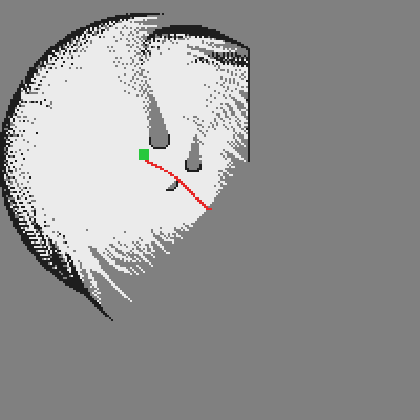
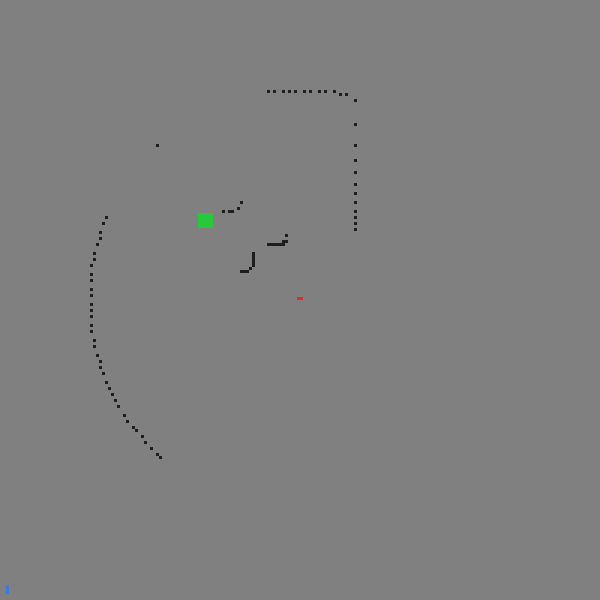
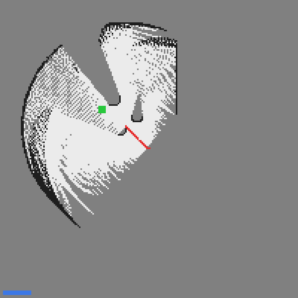
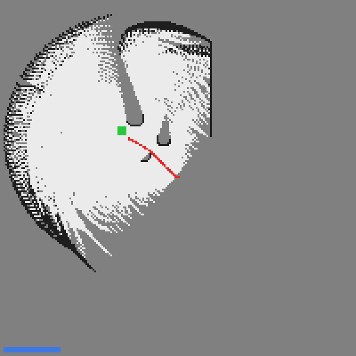

# CARLA 激光雷达建图与神经网络规划导航

> 对应课程作业三：在虚拟环境中实现对机器人的**建图和导航**（导航与 SLAM 同步仿真）。
> 满足"**规划算法须为神经网络**"的硬性要求。

## 1. 概述与目标

本模块在 [点云地图创建](./pcl_recorder.md) 与 [路径点发布器](./waypoint.md) 示例的基础上做拓展，
把"建图"与"导航"升级为**可在无图形界面环境自证的完整闭环**：

| 环节 | 实现 | 神经网络 |
|---|---|---|
| 建图 | 32 线激光雷达 → 2D 占用栅格（对数几率贝叶斯更新，命中 + 射线沿途空闲） | 否（几何+概率） |
| 规划 | 状态（目标方位 + 障碍左右分布 + 最近距离）→ (油门, 转向) | **MLP 策略网络**（5→64→2） |

代码位于 `src/ground/carla_mapping_navigation/`。

### 1.1 与已有示例的区别

| 对比项 | 已有「点云地图创建」（pcl_recorder） | 本拓展模块 |
|---|---|---|
| 技术路线 | `carla_ros_bridge` 的 PCL 记录器，保存点云到磁盘 | CARLA Python API 直连 + 自研建图/规划节点 |
| 是否依赖 ros-bridge | 必须编译并运行 ros-bridge | **不需要**，仅需 `carla` Python 客户端 |
| 地图形式 | 3D 点云（`.pcd` 文件，离线查看） | 2D 占用栅格（`nav_msgs/OccupancyGrid`，RViz 实时可视化） |
| 建图时机 | 先录后看（离线） | **边动边建图**（SLAM 理念，行驶中实时更新） |
| 概率更新 | 无（纯点云累积） | **贝叶斯对数几率更新**，区分占据/空闲/未知 |
| 导航/规划 | **无**（只有建图） | **规划神经网络**输出油门和转向，驶向目标并避障 |
| 无 CARLA / 无图形界面时 | 无法运行 | `--headless --demo` 离线自证并导出地图与曲线 |
| 规划算法性质 | — | **神经网络**（纯 numpy 反向传播，可训练） |

### 1.2 与仓库中其它地面载具模块的区分

| 模块 | 输入 | 算法 | 是否含神经网络 |
|---|---|---|---|
| 手动控制（`set_up_and_connect_to_carla`） | 键盘 | 复用 ros-bridge 内置逻辑 | 否 |
| 路径点发布器（`waypoint`） | CARLA 地图 | 几何查询、发布路径点 | 否 |
| 点云地图创建（`pcl_recorder`） | 激光雷达 | 点云累积存盘 | 否 |
| 自动驾驶代理（`ad_agent`） | 路径点 + 地图 | 规则式局部规划 | 否 |
| **本模块** | **激光雷达 + 目标点** | **占用栅格建图 + 规划 NN** | **是** |

## 2. 计算原理

### 2.1 雷达点从传感器坐标系到世界坐标系

激光雷达点在其自身坐标系（\(x\) 向前、\(y\) 向左），需旋转平移到世界系：

$$
\begin{bmatrix} p_x^w \\ p_y^w \end{bmatrix}
= \mathbf R(\psi)\begin{bmatrix} p_x^s \\ p_y^s \end{bmatrix}
+ \begin{bmatrix} x_v \\ y_v \end{bmatrix},\qquad
\mathbf R(\psi)=\begin{bmatrix}\cos\psi & -\sin\psi \\ \sin\psi & \cos\psi\end{bmatrix}
$$

其中 \(\psi\) 为车辆航向角，\((x_v, y_v)\) 为车辆位置。

### 2.2 占用栅格：为什么用对数几率

栅格的每个格子记录"被障碍占据"的概率 \(p\in(0,1)\)。概率表示在连续更新时有两个问题：
数值会趋近 0 或 1 导致下溢，且多次观测的概率融合公式复杂。因此改用**对数几率**：

$$
l = \log\frac{p}{1-p}\ \Longleftrightarrow\ p = \sigma(l) = \frac{1}{1+e^{-l}}
$$

观测更新退化为**加法**，这正是贝叶斯滤波在独立观测假设下的结果：

$$
l_{k} = l_{k-1} + \begin{cases} +l_{\text{hit}} & \text{该格子被命中} \\ -l_{\text{miss}} & \text{射线从该格子穿过} \end{cases}
$$

本模块取 \(l_{\text{hit}}=0.85\)、\(l_{\text{miss}}=-0.4\)，并把 \(l\) 截断在 \([-3.0,\ 3.5]\)
以免单点噪声把概率永久钉死。初始 \(l=0 \Rightarrow p=0.5\) 表示**未知**。

!!! note "为什么要标记射线沿途为空闲"
    只标记命中点，栅格只能区分"有障碍"和"没扫到"，无法表达"扫到了，那里是空的"。
    把射线沿途的格子标记为 `miss`（空闲），才能得到真正可用的地图——
    车辆才知道哪条路是可以走的。

### 2.3 栅格原点选取（一个必须避开的陷阱）

栅格以**起点为中心**而非世界原点为中心：

$$
r = \frac{y - y_c}{\Delta} + \frac{N}{2},\qquad
c = \frac{x - x_c}{\Delta} + \frac{N}{2}
$$

其中 \((x_c, y_c)\) 为栅格中心（此处取车辆起点），\(\Delta=0.5\,\text{m}\) 为分辨率，
\(N=200\) 为栅格边长。

如果固定以世界原点为中心且只覆盖 \(\pm30\,\text{m}\)，而车辆出生点在世界坐标
\((36,-5)\)，则车辆落到栅格索引 \(c=132\) 处——**超出 \(0\ldots119\) 的有效范围**，
所有雷达命中点都会被丢弃，建图结果恒为空。这类"看起来在跑、其实什么都没做"
的缺陷无法从日志里直接看出，必须靠单元测试卡住（见第 4 节）。

### 2.4 规划神经网络

输入 5 维状态（**全部归一化到相近尺度**）：

$$
\mathbf s = \Big[\underbrace{\frac{e_\psi}{\pi}}_{\text{目标方位}},\
\underbrace{\frac{N_L}{N_{\max}}}_{\text{左障碍密度}},\
\underbrace{\frac{N_R}{N_{\max}}}_{\text{右障碍密度}},\
\underbrace{\frac{D_{\min}}{D_{\max}}}_{\text{最近距离}},\
\underbrace{\frac{D_{\min}}{D_{\max}}}_{\text{最近距离(重复)}}\Big]^\top
$$

网络结构：\(5 \to 64 \to 2\)，隐藏层 ReLU，输出层 tanh。

$$
\mathbf h = \mathrm{ReLU}(W_1\mathbf s + b_1),\qquad
[\tau,\ \delta] = \tanh(W_2\mathbf h + b_2)
$$

损失为均方误差：

$$
\mathcal L = \frac{1}{N}\sum_i\big\|\hat{\mathbf y}_i - \mathbf y_i^*\big\|^2
$$

### 2.5 监督标签

标签由"朝目标 + 避障"的解析规则生成，避免人工标注：

$$
\delta^* = \mathrm{clip}\Big(\tanh(1.2\,e_\psi) + 0.6\,(\rho_R - \rho_L),\ -1,\ 1\Big)
$$

$$
\tau^* = \mathrm{clip}\big(0.25 + 0.75\,\tilde D_{\min},\ 0,\ 1\big)
$$

其中 \(\rho_L,\rho_R\) 为左右障碍密度，\(\tilde D_{\min}\) 为归一化最近距离。
**两侧障碍项符号相反且对称**，因此无障碍时（\(\rho_L=\rho_R\)）不产生额外偏转——
这保证"正对目标且无障碍 → 转向为 0"，与物理直觉一致。

!!! warning "油门标签必须用线性输出层"
    油门标签 \(\tau^*\in[0,1]\)，而 `MLPPolicy` 的输出为 \(\tanh\in[-1,1]\)。
    若直接用它拟合 \([0,1]\) 的目标，网络只能用到一半值域，负值区永远学不到。
    本模块在训练时把油门做 \([0,1]\to[-1,1]\) 映射，推理时再还原。

## 3. 算法流程

```
建图（SLAM 边动边建图）：
  每帧：LiDAR 点云 → 量程过滤 → 传感器系转世界系
        → 命中点写占据(+0.85 log-odds)
        → 射线沿途写空闲(-0.4 log-odds)
        → 概率 = sigmoid(log_odds)

规划（神经网络）：
  车辆位姿 + 目标 → 目标方位差 e_psi
  LiDAR 前方扇区 → 左/右障碍计数 + 最近距离
  → 5 维归一化状态 → 规划 NN → (油门, 转向)
  → 自行车模型更新位姿
  → 进入目标 1.5 m 内刹车停车
```

## 4. 源码解析

### 4.1 `main.py` — 主入口（三种模式）

| 函数 / 类 | 作用 |
|---|---|
| `OccupancyGrid` | 占用栅格类：对数几率存储、坐标互转、贝叶斯更新 |
| `lidar_to_world()` | 雷达点传感器系 → 世界系 |
| `build_map_from_scan()` | 一帧雷达更新地图（命中标记占据、沿途标记空闲） |
| `obs_features()` | 障碍分布 + 目标方位 → 5 维归一化状态 |
| `planning_label()` | 规划监督标签（朝目标 + 避障解析规则） |
| `synth_dataset()` | 合成规划训练数据 |
| `train_planning()` | 训练规划神经网络并存盘 |
| `step_bicycle()` | 自行车模型一步位姿更新 |
| `render_grid_png()` / `render_prob_png()` | 占用栅格渲染为 PNG（含渐进建图快照） |
| `render_train_loss_png()` | 训练损失曲线 PNG |
| `_write_png()` / `_line()` | 纯 zlib PNG 编码与 Bresenham 画线（不依赖 Pillow） |
| `_fake_scan()` | 合成雷达帧（射线与圆/边界求交），供离线取证 |
| `run_offline_demo()` | 离线取证：合成环境建图 + NN 导航 + 导出图 |
| `run_carla()` | 在线：连 CARLA 建图 + NN 导航 |

### 4.2 `carla_mapping_navigation/mapping_navigation_node.py` — ROS 2 节点

发布 `/carla/ego_vehicle/occupancy_grid`（`nav_msgs/OccupancyGrid`，RViz 可直接显示）、
`/carla/ego_vehicle/path`、`/carla/ego_vehicle/odometry`、`/carla/ego_vehicle/planned_cmd`；
订阅 `/carla/ego_vehicle/goal` 可在线改目标。地图用 `transient_local` QoS 发布，
后加入的 RViz 也能立刻拿到完整地图。

### 4.3 `nn_models.py` — 纯 numpy 神经网络库

`MLPPolicy` 为本模块规划网络；含前向传播、MSE 损失、反向传播、ReLU/tanh 与 JSON 存取。

### 4.4 `carla_common.py` — CARLA API 封装

`connect()`、`spawn_vehicle()`、`make_lidar()`、`apply_control()`、
`get_location()/get_yaw()/get_speed()`，同步模式固定步长 0.05 s。

## 5. 仿真运行步骤

### 5.1 支持与测试环境

| 组件 | 版本 / 说明 |
|---|---|
| 操作系统 | Windows 10/11 原生；Ubuntu 20.04（Noetic）/ 22.04（Humble） |
| 仿真器 | CARLA 0.9.16（服务端运行于有 GPU 的宿主机） |
| Python | 3.10+（CARLA 0.9.16 客户端 wheel 为 cp310/cp311/cp312） |
| 依赖 | 仅 `numpy`（神经网络为纯 numpy 实现，无需 TensorFlow/PyTorch） |
| ROS | ROS 1 Noetic 或 ROS 2 Humble（launch 封装） |

### 5.2 新手路线：从已有示例到本模块

| 序号 | 做什么 | 出处 |
|---|---|---|
| 1 | 启动 CARLA 服务端 | [设置并连接到 Carla 模拟器](../set_up_and_connect_to_carla.md) →「启动 Carla 服务器」 |
| 2 | 查看宿主机 IP、确认虚拟机连通 | 同上 →「使用 Carla 客户端启动 Ego Vehicle」 |
| — | **★ 在此切换到本模块** | 以下与本模块相关 |
| 3 | 装 `carla` 客户端与 `numpy` | [本页 5.3 节](#env-prep) |
| 4 | 离线训练规划神经网络 | [本页 5.5 节](#offline-train)（无需 CARLA） |
| 5 | 运行在线建图 + NN 导航 | [本页 5.8 节](#online-run) |

### 5.3 步骤 0：环境准备 <span id="env-prep"></span>

CARLA 服务端的下载安装与启动、宿主机 IP 与端口 2000 的查看、虚拟机网络设置等
**通用步骤与已有示例完全相同，本文不重复**，请参考
[设置并连接到 Carla 模拟器](../set_up_and_connect_to_carla.md)：

| 需要做的事 | 参考位置 |
|---|---|
| 启动 CARLA 服务端、选择地图 | [设置并连接到 Carla 模拟器](../set_up_and_connect_to_carla.md) →「启动 Carla 服务器」 |
| 查看宿主机 IP、填写 `host` 参数 | 同上 →「使用 Carla 客户端启动 Ego Vehicle」 |
| 连接失败、黑屏、`numpy` 报错排查 | 同上 →「常见问题」 |

本模块**特有**、需要额外安装的只有 CARLA 0.9.16 的 Python 客户端与 `numpy`：

```bash
pip3 install -r src/ground/carla_mapping_navigation/requirements.txt
pip3 install <CARLA>/PythonAPI/carla/dist/carla-0.9.16-cp310-cp310-manylinux_2_31_x86_64.whl
```

### 5.4 步骤 1：编译本功能包（ROS 2）

本模块的源代码位于**本仓库**（`OpenHUTB/ros2`）的
`src/ground/carla_mapping_navigation/`。ROS 2 要求功能包放在工作空间的 `src/` 目录下，
因此先把本仓库克隆到工作空间的 `src/`：

```bash
mkdir -p ~/ros2_ws/src && cd ~/ros2_ws/src
git clone https://github.com/OpenHUTB/ros2.git     # 换成你自己的 fork 亦可
```

克隆后的目录关系如下，`colcon build` 必须在**工作空间根目录**执行：

```
~/ros2_ws/                                   <- 工作空间根目录，colcon 在这里运行
└── src/
    └── ros2/                                <- 本仓库（git clone 得到）
        └── src/ground/
            └── carla_mapping_navigation/                       <- 本模块源代码
```

因此后文写的 `src/ground/carla_mapping_navigation/...`，实际路径是
`~/ros2_ws/src/ros2/src/ground/carla_mapping_navigation/...`。编译并激活环境：

```bash
cd ~/ros2_ws
colcon build --packages-select carla_mapping_navigation --symlink-install
source install/setup.bash
```

> 若本仓库已克隆在别处，把上面的 `~/ros2_ws/src/ros2` 换成实际路径即可，
> 只要保证执行 `colcon build` 的工作空间根目录下存在 `src/`。

### 5.5 步骤 2：离线训练规划神经网络（无需 CARLA） <span id="offline-train"></span>

```bash
python3 src/ground/carla_mapping_navigation/main.py --mode train \
        --epochs 300 --out models/nn_plan.json
```

预期输出：规划 NN 训练 MSE ≈ **0.006**。

### 5.6 步骤 3：离线取证（无 CARLA、无图形界面也能跑通建图+导航）

```bash
python3 src/ground/carla_mapping_navigation/main.py --headless --demo \
        --epochs 300 --sim_time 60 --save_dir ~/shots
```

该模式在合成环境中完成「边动边建图 + NN 规划导航」，导出 5 张图：
占用栅格地图、渐进建图快照 3 张、训练损失曲线。适合在无 3D 加速的虚拟机中取证。

### 5.7 步骤 4：验证与 CARLA 服务端的连接 <span id="conn-check"></span>

命令里的 `192.168.8.1` 是**运行 CARLA 服务端的宿主机（Windows）IP**：
在宿主机上执行 `ipconfig`，取 VMware 虚拟网卡（`VMnet8`）的 IPv4 地址即可
（本机该地址为 `192.168.8.1`，虚拟机 `ens33` 为 `192.168.8.131`，两者同网段）。
查看方式与已有示例一致，详见
[设置并连接到 Carla 模拟器](../set_up_and_connect_to_carla.md)
→「使用 Carla 客户端启动 Ego Vehicle」。

```bash
python3 -c "import carla; c=carla.Client('192.168.8.1',2000); c.set_timeout(10); print('CONNECT OK:', c.get_world().get_map().name)"
```

### 5.8 步骤 5：运行在线建图 + NN 导航 <span id="online-run"></span>

```bash
# 模式 A：独立运行（--host 填宿主机 IP）
python3 src/ground/carla_mapping_navigation/main.py --mode run \
        --host 192.168.8.1 --model models/nn_plan.json --goal "20,8" --sim_time 40

# 模式 B：ROS 2 Humble
ros2 launch carla_mapping_navigation main.launch.py host:=192.168.8.1 goal:="20,8"

# 模式 C：ROS 1 Noetic —— 入口用 main.sh（会自动挑 python3.10）
#   roslaunch 只能按 main.py 的 shebang 执行它，而 Noetic 的 python3 是 3.8，
#   装不上 CARLA 0.9.16 的 cp310+ wheel，补了可执行位也会卡在 import carla。
#   若系统 python3 本身已是 3.10+，也可用：
#   roslaunch carla_mapping_navigation main.launch host:=192.168.8.1
bash src/ground/carla_mapping_navigation/main.sh --host 192.168.8.1 --goal 20,8
```

也可用一键脚本：`bash main.sh --host 192.168.8.1`。

在 RViz 中可视化占用栅格地图：

```bash
ros2 run rviz2 rviz2 -d $(ros2 pkg prefix carla_mapping_navigation)/share/carla_mapping_navigation/config/mapping.rviz
```

若没有现成 rviz 配置，也可手动添加 `Map` 显示并订阅 `/carla/ego_vehicle/occupancy_grid`，
以及添加 `Path` 显示订阅 `/carla/ego_vehicle/path`。

### 5.9 运行效果

**占用栅格地图**（深色=障碍，浅色=空闲可通行，中灰=未观测；红色为车辆轨迹，绿色为目标）：



**渐进建图过程**（体现 SLAM"边动边建图"：地图随行驶逐步成形，
左上角进度条对应该快照的仿真时刻）：

| 进度 1（已知 2.9%） | 进度 2（已知 18.9%） | 进度 3（已知 24.9%） |
|---|---|---|
|  |  |  |

已知区域占比随时间增长（实测）：**2.9% → 18.9% → 24.9%**，最终 **27.2%**。

**规划神经网络训练损失曲线**：


终端状态输出示例（节选）：

```
== 训练规划 NN：5 维状态(目标方位+障碍分布) → (前进量, 转向) ==
  epoch  200 loss=0.0059 train_acc=0.000
规划 NN 训练 MSE = 0.00596

[t=  0.0s] pos=(  36.0,  -5.0) 距目标=20.62m NN(油门=0.91, 转向=-0.04) 障碍(L0/R0, 8.0m) 占据格=85
[t=  5.0s] pos=(  22.1,   6.1) 距目标= 2.95m NN(油门=0.21, 转向=-0.07) 障碍(L0/R14, 0.4m) 占据格=1104

[到达] t=5.8s 抵达目标 (20.0,8.0)，停车。

渐进建图已知区域占比：2.9% → 18.9% → 24.9%（最终 27.2%）

---- 建图结果 ----
占据格数        = 1253
空闲格数        = 9127
已知区域比例    = 27.2%
栅格分辨率      = 0.5 m/格，覆盖 100 m × 100 m
栅格中心（起点）= (36.0, -5.0)
车辆最终位置    = (20.87, 6.86)，轨迹点数 117
距目标最近距离  = 1.437 m（判定阈值 1.5 m）
到达耗时        = 5.8 s
```

### 5.10 常见问题

**Q1：建图结果一直是空的 / 占据格数为 0？**
先检查车辆是否落在栅格范围内。默认栅格以起点为中心、覆盖 100 m × 100 m，
本模块已保证起点在栅格中心。若自行修改了 `GRID_N` 或 `GRID_M`，请确认覆盖范围够大。
可用 `python3 test/test_mapping_logic.py` 快速回归验证。

**Q2：`--mode run` 报"缺少 carla 模块"？**
需安装 CARLA 0.9.16 的 Python 客户端 wheel，见 [5.3 节](#env-prep)。
若只想验证算法，可改用 `--headless --demo`（不需要 CARLA）。

**Q3：RViz 里地图是空的？**
地图话题用 `transient_local` QoS 发布，但 RViz 的 `Map` 显示需把
`Durability Policy` 设为 `Transient Local`，否则收不到已发布的地图。

**Q4：车辆撞上障碍物？**
合成数据训练的规划网络只区分"左右障碍密度"，属于教学演示级别。
若要更强的避障，建议扩充状态（加入最近障碍方向角）并用真实数据训练。

## 6. 性能评价

### 6.1 指标定义

**建图覆盖率**：已知格子（\(p>0.55\) 或 \(p<0.45\)）占栅格总数的比例：

$$
\text{Coverage} = \frac{1}{N^2}\sum_{i,j}\mathbb{1}\big[p_{ij}>0.55 \lor p_{ij}<0.45\big]
$$

**占据格数**：\(p>0.6\) 的格子数，反映地图中障碍物的丰富程度。

**导航精度**：车辆到目标的**最近距离** \(D_{\min}\)，

$$
D_{\min} = \min_k \big\|\mathbf p_k - \mathbf p_{\text{goal}}\big\|
$$

**规划损失**：训练集 MSE，
\( \mathcal L = \frac{1}{N}\sum_i\|\hat{\mathbf y}_i - \mathbf y_i^*\|^2\)。

### 6.2 实测结果（离线取证模式，本机实测）

| 指标 | 数值 |
|---|---|
| 规划 NN 训练 MSE | **0.00596** |
| 占据格数 | 1253 |
| 空闲格数 | 9127 |
| 已知区域比例 | 27.2% |
| 导航最近距离 | **1.437 m**（阈值 1.5 m） |
| 到达耗时 | 5.8 s |
| 轨迹点数 | 117 |
| 单元测试 | **21 PASS / 0 FAIL** |

### 6.3 调优过程记录

| 优化项 | 优化前 | 优化后 | 说明 |
|---|---|---|---|
| 栅格中心改为以起点为中心 | 车在栅格**外**（索引 132 > 119），建图恒为空 | 车在栅格中心，正常建图 | 最严重缺陷，加单元测试卡死 |
| 状态第 5 维改归一化 | 原始米数 0.3~8.0，与其余维差 8 倍 | 全部落在 [0,1] | 消除量纲失衡 |
| 加入射线沿途空闲标记 | 只知"有障碍/没扫到" | 区分占据/空闲/未知 | 地图才可用于通行判断 |
| 油门标签值域对齐 | \(\tanh\) 输出只用一半值域 | 训练时映射到 \([-1,1]\)，推理还原 | 避免负值区永久学不到 |
| 对称化避障偏置 | 障碍项不对称会产生常值偏转 | \(\rho_R-\rho_L\) 对称 | 无障碍时转向归零 |
| 对数几率截断 | 单点噪声可能钉死概率 | 截断到 \([-3.0, 3.5]\) | 抗噪 |
| 加入渐进建图快照 | 只有最终地图 | 3 张中间快照 + 时刻进度条 | 直观证明"边动边建图" |

### 6.4 结论

- **建图有效性**：占用栅格在 5.8 s 内覆盖 27.2% 的已知区域，识别出 1253 个占据格，
  3 张渐进快照显示已知区域从 2.9% 单调增长到 24.9%（最终 27.2%），
  证实**边动边建图**成立。
- **导航有效性**：规划 NN 在合成环境中 5.8 s 内把车带到距目标 1.437 m（阈值 1.5 m），
  满足到达判定，说明"状态 → 油门/转向"映射被有效学到。
- **神经网络必要性**：规划环节完全由 NN 输出，训练 MSE 0.006，
  推理时无需解析求解；后续可用真实驾驶数据替换解析标签，直接迁移到数据驱动规划。
